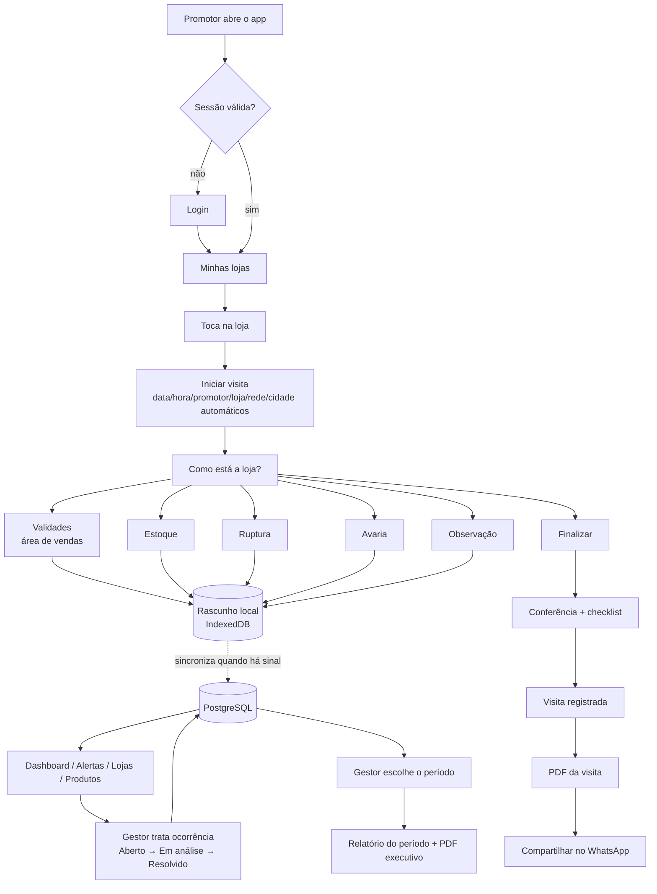

# SUINCO | Gestão de Loja — Análise e Arquitetura

Plataforma MCX para a operação AF Merchandising → SUINCO.
Substitui o relatório em texto livre no WhatsApp por coleta estruturada, mantendo o
WhatsApp apenas como **canal de envio do PDF**.

> WhatsApp = comunicação · Sistema = registro oficial · Dashboard = gestão · Relatório semanal = decisão

---

## 0. O que os prints mostram (e o que isso muda no produto)

Analisei os 6 relatórios reais. Os problemas não são só "falta de padrão"; cada um vira uma decisão de UX:

| Observado nos relatórios | Problema real | Decisão no sistema |
|---|---|---|
| `venc 05/10`, `Venc 09/10` — data **sem ano** | O promotor digita o mínimo possível | Campo de validade aceita **só DDMM** no teclado numérico (`0510` → 05/10/2026). O ano é inferido (próxima ocorrência da data). Calendário continua disponível. |
| `4 bacon 07/12/2016` | Erro de digitação do ano (2016 em vez de 2026) | Data muito no passado ou muito no futuro gera **aviso de confirmação** ("Você quis dizer 07/12/2026?") com botão de correção em 1 toque. |
| `28/20/26` (no exemplo do enunciado) | Data impossível | Bloqueada na digitação. Nunca é salva. |
| `alcatra 36`, `bacon cubos 250g 120 un`, `ling embutido misto 2,5kg`, `embutido misto 6 un` | O mesmo produto escrito de 3 formas | **Catálogo de produtos com apelidos** + busca tolerante (sem acento, por pedaço de palavra: "emb mis" acha "Linguiça Embutido Misto 2,5kg"). |
| A mesma loja recebe praticamente os **mesmos produtos** toda visita | O promotor redigita a lista inteira toda vez | **"Repetir produtos da última visita"**: a lista da visita anterior da loja vira um checklist; o promotor só ajusta quantidade e validade. É o maior ganho de velocidade do produto. |
| `7 alcatra 03/10` e `15 alcatra 16/10` | Mesmo produto, lotes/validades diferentes | Botão **"+ outro lote"** no item: duplica o produto mantendo-o selecionado, pede só quantidade e validade. |
| `28cx Apresuntado`, `1 cx ling...` vs `29 picanha` | Estoque é contado em **caixas**, área de vendas em **unidades** | Unidade por item com padrão inteligente: área de vendas = `un`, estoque = `cx`. Chip para trocar (`un` / `cx` / `kg`). |
| `🚨` ao lado das datas próximas | O promotor faz a classificação de cabeça, e de forma inconsistente | O sistema calcula dias restantes e classifica sozinho (Vencido / Crítico / Alto / Atenção / Monitoramento / Normal). O promotor não classifica nada. |
| `🚨 Ruptura` sem nenhum item, `SEM PRODUTOS EM ESTOQUE` | Não dá para distinguir "não verifiquei" de "verifiquei e não havia nada" | **Checklist da visita** com estado explícito por seção: "Sem ocorrências" é uma resposta registrada, não um vazio. |
| Cabeçalho repetido: Data / Cidade / Super / Loja | Redigitado a cada relatório, com variações ("Super. Abc", "Super. ABC", "Super: BH") | Tudo vem do cadastro da loja. Data, horário, promotor, rede e cidade são automáticos. |
| Quantidades sem unidade, nomes abreviados ("ling", "pe salgado") | Dado inconsistente para análise | Quantidade numérica obrigatória; produto sempre do catálogo (com "produto não cadastrado" como saída de emergência que vai para a fila do gestor). |

### Planilhas de MIX (ABC Varejo/Plus/Cash e BH Varejo)

| Observado nas planilhas | Decisão no sistema |
|---|---|
| Cada rede tem um mix por **formato de loja** (ABC: Varejo 18, Plus 30, Cash 42 itens; BH: Varejo 6) | A loja é cadastrada com **rede + formato**. Ao iniciar a visita o app já mostra o mix certo — o promotor não escolhe a rede (um toque a menos e nenhuma chance de escolher errado). |
| Duas colunas de código: **código da rede** (o da etiqueta da gôndola) e **código SUINCO** | A busca aceita os dois. O promotor pode digitar o número da etiqueta. |
| Listas longas (até 42 itens) | Tela de produto = **lista completa do mix + busca no topo que filtra enquanto digita**. Itens da última visita aparecem primeiro; produtos fora do mix aparecem só na busca. |
| Aba `vigente` com preço por código SUINCO | Vira o **preço de tabela** do produto, mostrado como referência ao lado do campo **Preço**, que agora é visível e entra no fluxo do teclado (quantidade → validade → preço). |
| Planilhas mudam com o tempo | **Administração › Importar planilha** recebe o arquivo como a SUINCO envia: cria produtos novos pelo código SUINCO, atualiza preço e substitui o mix do formato. |

**Consequência:** a tela principal do promotor não é um formulário. É uma **lista de produtos da loja** em que cada linha é preenchida com 2 toques + 4 dígitos.

---

## 1. Arquitetura da solução

```
┌────────────────────────── Navegador (celular do promotor / desktop do gestor) ─────────────────────────┐
│  PWA (instalável)                                                                                        │
│  ├─ Service Worker: cache do app do promotor (abre sem internet)                                        │
│  ├─ IndexedDB: rascunho da visita, fila de sincronização, fotos pendentes, catálogo de lojas/produtos   │
│  └─ Compressão de fotos no aparelho (≤1600px, JPEG ~80%) antes do envio                                 │
└───────────────┬─────────────────────────────────────────────────────────────────────────────────────────┘
                │ HTTPS (cookie de sessão httpOnly)
┌───────────────▼──────────────────────── Next.js 16 (App Router, TypeScript) ─────────────────────────────┐
│  proxy.ts ─ redireciona por perfil (checagem otimista)                                                    │
│  Server Components ─ páginas do gestor (consultas direto no banco, sem API intermediária)                 │
│  Route Handlers /api ─ sync do promotor, upload de foto, PDFs, exportações                                │
│  Camada de domínio (src/server):                                                                          │
│     auth · scope (isolamento por cliente/promotor) · validity (regras de validade) · analytics ·          │
│     insights · reports · pdf · storage · audit · import/export                                            │
└───────┬──────────────────────────────┬───────────────────────────────────────────────────────────────────┘
        │ Drizzle ORM                  │ Storage
┌───────▼─────────┐          ┌─────────▼───────────┐
│ PostgreSQL       │          │ Supabase Storage    │
│ (Supabase)       │          │ bucket PRIVADO      │
│ dev: PGlite      │          │ dev: disco local    │
└──────────────────┘          └─────────────────────┘
```

Decisões principais:

- **Next.js + PostgreSQL (Supabase)**: o Supabase já é usado hoje (Postgres + Storage), então não há infraestrutura nova a contratar além da hospedagem do app.
- **Saída do Streamlit para este produto**: o Streamlit depende de WebSocket contínuo com o servidor — não funciona offline, não permite um fluxo mobile rápido (cada toque recarrega o script) e não gera PDF/dashboards no nível pedido. Os apps Streamlit atuais continuam no ar até o corte (ver Roadmap).
- **Toda leitura/escrita passa pelo servidor**, nunca do navegador direto no banco. O isolamento entre clientes e entre promotores é feito numa única camada (`src/server/scope.ts`) usada por todas as consultas. Ver item 11 sobre RLS.
- **Banco de desenvolvimento embutido (PGlite)**: `npm run dev` funciona sem instalar Postgres nem Docker; em produção basta apontar `DATABASE_URL` para o Supabase. Mesmo SQL, mesmas migrações.

---

## 2. Fluxograma do sistema



---

## 3. Estrutura do banco de dados

Hierarquia multi-tenant:

```
MCX (plataforma)
 └── tenants            → AF Merchandising (agência)      ← isolamento forte
      └── clients        → SUINCO (marca atendida)          ← todos os dados operacionais
           ├── networks  → Super ABC, Super BH
           ├── stores    → ABC Formiga loja 63 ...
           ├── products  → Picanha Suína Temperada ...
           └── visits → occurrences → occurrence_photos / occurrence_actions
```

| Tabela | Função | Campos-chave |
|---|---|---|
| `tenants` | Agência cliente da MCX | name, slug |
| `clients` | Marca atendida (SUINCO) | tenant_id, name, slug |
| `client_settings` | Parâmetros configuráveis pelo gestor | faixas de validade, pesos do índice de criticidade, limiares de status da loja, checklist |
| `users` | Todas as pessoas que acessam (promotor, gestor, admin) | tenant_id, role, name, username, email, phone, document, password_hash, status, failed_logins, locked_until, session_version |
| `user_clients` | Quais marcas cada usuário enxerga | user_id, client_id |
| `store_assignments` | Lojas atendidas por promotor | user_id, store_id |
| `networks` | Redes | client_id, name |
| `stores` | Lojas | client_id, network_id, **format** (varejo/plus/cash), name, code, address, city, state, lat, lng, manager_name, status |
| `products` | Catálogo | client_id, code (SUINCO, único), name, category, brand, presentation, default_unit, aliases[], reference_price, status |
| `product_mixes` | Mix por rede + formato (planilhas da SUINCO) | network_id, format, product_id, chain_code (código da rede), seq, note |
| `visits` | Uma ida à loja | id (UUID gerado no celular), client_id, store_id, promoter_id, started_at, finished_at, status, checklist, notes |
| `occurrences` | Cada item registrado | id (UUID do celular), visit_id, store_id, product_id, **type** (validity / rupture / damage / note), location, quantity, unit, expiry_date, days_to_expiry, severity, lot, price, rupture_kind, damage_kind, notes, status |
| `occurrence_photos` | Fotos vinculadas ao item | occurrence_id, visit_id, storage_key, bytes, width, height |
| `occurrence_actions` | Tratamento da ocorrência | occurrence_id, from_status, to_status, action_text, action_date, responsible_id |
| `weekly_reports` | Snapshot imutável do relatório semanal | client_id, period_start, period_end, data (JSON), generated_at |
| `audit_logs` | Toda alteração importante | entity, entity_id, action, before, after, user_id |
| `notifications` | Estrutura para alertas futuros | user_id, kind, payload, channel, read_at |

**Por que uma tabela `occurrences` em vez de `visit_items` + `ruptures` + `damages` separadas:**
todos os indicadores pedidos ("ocorrências por loja", "produto com mais problemas", índice de criticidade) cruzam os tipos. Com tabela única, cada indicador é uma consulta; com quatro tabelas, cada indicador vira um `UNION` e cada filtro precisa ser replicado quatro vezes. Os campos específicos de cada tipo são colunas opcionais com `CHECK` no banco garantindo a coerência (ex.: validade obrigatória para `validity`).

**"Produtos em estoque"** não é um tipo à parte: é `type = validity` com `location = stock`. Assim o mesmo produto pode ser comparado entre área de vendas e estoque.

**Por que `users` única em vez de `promoters` + `managers`:** a mesma pessoa pode mudar de papel, e login/sessão/auditoria são idênticos. O papel é a coluna `role`; dados específicos (lojas atendidas) ficam em `store_assignments`.

Todas as tabelas operacionais têm `created_at`, `updated_at`, `created_by`, `updated_by`. Nada é apagado fisicamente: registros têm `status`/`deleted_at`.

---

## 4. Lista de telas

**Promotor (mobile)**
1. Login
2. Início — saudação, visita em andamento (retomar), lojas de hoje, pendências de sincronização
3. Minhas lojas — busca, última visita de cada loja
4. Visita › Como está a loja? (hub com contadores por seção)
5. Visita › Validades (área de vendas) — lista rápida + "repetir última visita"
6. Visita › Estoque
7. Visita › Ruptura — seleção múltipla do mix da loja
8. Visita › Avaria
9. Visita › Observação geral
10. Visita › Conferência (resumo + checklist)
11. Visita registrada — Baixar PDF / Compartilhar / Nova visita
12. Histórico — minhas visitas, reabrir PDF
13. Meu perfil — trocar senha, sair, status de sincronização

**Gestor (desktop e mobile)**
14. Dashboard
15. Alertas
16. Lojas (lista + mapa) › Página da loja
17. Produtos › Página do produto
18. Visitas › Detalhe da visita (com fotos e PDF)
19. Ocorrência (drawer) — fotos, histórico de tratamento, mudar status
20. Promotores — visitas por promotor, última atividade
21. Relatórios semanais › Relatório (visualização + PDF)
22. Configurações — faixas de validade, pesos, checklist

**Admin**
23. Usuários · 24. Redes · 25. Lojas · 26. Produtos · 27. Importação (Excel/CSV) · 28. Auditoria

---

## 5. Fluxo completo do promotor

1. **Login** com usuário + senha (sessão de 30 dias no aparelho — ninguém quer digitar senha dentro do mercado).
2. **Minhas lojas** mostra apenas as lojas atribuídas, ordenadas por "há mais tempo sem visita".
3. **Toque na loja → Iniciar visita.** O app cria a visita no aparelho (UUID) e já funciona mesmo sem sinal.
4. **Como está a loja?** — 5 blocos grandes com contador: Validades, Estoque, Ruptura, Avaria, Observação.
5. **Validades**: aparece a lista da última visita da loja como sugestão. Para cada produto:
   - toque no produto → teclado numérico abre para **quantidade** → `Enter` → teclado numérico para **validade (DDMM)** → salvo;
   - o selo de classificação aparece na hora (ex.: `CRÍTICO · 2 dias`);
   - foto opcional pelo ícone da câmera (abre a câmera traseira direto);
   - "+ outro lote" para o mesmo produto com outra validade.
   Um produto novo é adicionado pela busca no topo.
6. **Estoque**: mesma mecânica, unidade padrão `cx`.
7. **Ruptura**: grade com o mix da loja; toque marca o produto em falta e alterna o tipo (total → parcial → não localizado). Botão "Sem rupturas".
8. **Avaria**: produto + quantidade + tipo (chips) + foto (obrigatória para avaria, é a evidência).
9. **Finalizar**: conferência com totais por seção, alertas de vencidos/críticos em destaque e checklist (área de vendas / estoque / validades / ruptura / avarias). Seções sem registro precisam ser marcadas como "verificado, sem ocorrência" — é isso que diferencia "não olhei" de "não havia".
10. **Visita registrada**: Baixar PDF · Compartilhar (abre o menu nativo do Android com o PDF anexado → WhatsApp) · Nova visita.

Tempo-alvo: 10 produtos em menos de 2 minutos.

---

## 6. Fluxo completo do gestor

1. Abre o **Dashboard** (período padrão: últimos 7 dias). Os 6 cards respondem "como está a operação"; a faixa de **insights** responde "o que mudou".
2. Clica num card ou num ponto de gráfico → vai para a lista filtrada (Alertas, Lojas, Produtos).
3. **Alertas** mostra só a **situação atual** (ver regra 10.6): o que a última visita de cada loja encontrou e ainda não foi tratado.
4. Abre a ocorrência → vê foto, histórico e muda o status (Aberto → Em análise → Resolvido / Ignorado) registrando a ação tomada.
5. **Terça-feira**: abre Relatórios → escolhe o período (já vem preenchido com a semana anterior) → Gerar relatório → revisa → baixa o PDF executivo → envia ao gestor da SUINCO.

---

## 7. Estrutura dos dashboards

**Filtros (barra fixa, refletidos na URL — o link pode ser compartilhado):** período (hoje, 7, 15, 30 dias, mês atual, mês anterior, personalizado), rede, loja, cidade, promotor, produto, categoria, tipo de ocorrência.

**Linha 1 — KPIs** (cada um com variação vs. período anterior equivalente): Visitas · Próximos ao vencimento · Vencidos · Rupturas · Avarias · Lojas com alerta.

**Linha 2 — Insights automáticos** (3 a 5 frases, só quando há base estatística).

**Linha 3** — Itens por faixa de validade (barras horizontais coloridas por severidade) · Evolução diária de ocorrências por tipo (linha).

**Linha 4** — Ranking de produtos (quantidade próxima ao vencimento) · Ranking de lojas por índice de criticidade.

**Linha 5** — Mapa das lojas (cor = situação) · Atividade dos promotores (visitas no período, última visita).

**Índice de criticidade da loja** (pesos configuráveis em Configurações):

```
índice = vencidos×10 + críticos(0–3d)×5 + altos(4–7d)×3 + rupturas×3 + avarias×2 + atenção(8–15d)×1
Situação: Normal < 10 ≤ Atenção < 25 ≤ Crítica
```

Contagem por **item** (linha registrada), não por unidade — 120 bacons de um mesmo lote são um problema, não 120.

---

## 8. Estrutura do PDF da visita

A4 retrato, pensado para ser lido **no celular** dentro do WhatsApp (fonte grande, poucas colunas):

1. **Faixa de cabeçalho** azul-marinho: SUINCO · Relatório de Visita · AF Merchandising
2. **Bloco de identificação** em 2 colunas: Promotor, Data, Horário (início–fim), Rede, Loja, Cidade
3. **Resumo** em 4 cartões: Próximos ao vencimento · Estoque · Rupturas · Avarias — com destaque vermelho se houver vencidos
4. **Produtos na área de vendas × Validade**: Produto | Qtd | Validade | Dias | Classificação (selo colorido). Ordenado do mais urgente para o menos.
5. **Produtos em estoque × Validade**: mesma tabela
6. **Rupturas**: Produto | Situação | Observação
7. **Avarias**: Produto | Qtd | Tipo | Observação
8. **Observações gerais**
9. **Registro fotográfico**: grade 2×N com legenda (produto, qtd, validade)
10. **Rodapé**: "Relatório gerado automaticamente pelo sistema · ID da visita · página X/Y"

Seções vazias aparecem como "Nenhuma ocorrência registrada" (o gestor precisa saber que foi verificado).

---

## 9. Estrutura do relatório semanal

Período: **escolhido pelo gestor** (padrão: segunda a domingo da semana anterior), gerado sob demanda em Relatórios. A comparação é sempre com o período anterior de mesmo tamanho. Decisão do usuário: sem rotina automática — o envio para a SUINCO continua manual, toda terça.

1. **Capa**: SUINCO · Relatório Semanal · período · AF Merchandising / MCX
2. **Resumo executivo**: visitas, lojas visitadas, próximos ao vencimento, vencidos, rupturas, avarias — cada um com variação vs. semana anterior
3. **Gráficos**: faixa de validade; ocorrências por dia
4. **Top 10 produtos próximos ao vencimento**: Produto | Quantidade | Lojas afetadas | Menor validade
5. **Top 10 lojas mais críticas**: Loja | Cidade | Ocorrências | Índice | Situação
6. **Produtos vencidos** (lista completa)
7. **Rupturas** (por produto e por loja)
8. **Avarias** (por tipo e por produto)
9. **Principais insights** (gerados dos dados)
10. **Recomendações** (regras determinísticas a partir dos insights — ex.: loja crítica 2 semanas seguidas → "priorizar visita e negociação de rebaixa")
11. Rodapé: AF Merchandising · Operação SUINCO

O relatório é salvo como **snapshot imutável** (JSON) em `weekly_reports`: se alguém corrigir um dado depois, o relatório que foi enviado continua igual ao que foi enviado. O PDF é gerado a partir do snapshot sempre que solicitado.

---

## 10. Regras de negócio

1. **Dias restantes** = validade − data da visita (no fuso America/Sao_Paulo). Gravado na ocorrência (`days_to_expiry`) para o histórico; recalculado contra "hoje" nas telas de alerta.
2. **Classificação** (configurável): Vencido < 0 · Crítico 0–3 · Alto 4–7 · Atenção 8–15 · Monitoramento 16–30 · Normal 31+.
3. **"Próximo ao vencimento"** = classificação de Crítico a Monitoramento (≤ 30 dias, configurável).
4. **Data inválida** (dia/mês impossível) nunca é salva. Data com vencimento há mais de 60 dias, ou mais de 2 anos no futuro, exige confirmação explícita (pega o erro "2016").
5. **Data sem ano** (DDMM): assume o ano corrente; se isso der mais de 60 dias no passado, assume o próximo ano.
6. **Situação atual da loja = última visita finalizada.** Quando o promotor visita a loja de novo, as ocorrências abertas da visita anterior que não foram tratadas passam a "substituídas" para efeito de alerta (continuam no histórico). Sem essa regra, o mesmo lote de picanha relatado em 3 visitas apareceria 3 vezes nos alertas.
7. Quantidade é inteira e > 0 (exceto observação). Avaria exige foto.
8. Uma visita só pode ser **editada pelo promotor até 24h após a finalização**; depois, só por gestor, e sempre auditada.
9. Exclusão é sempre lógica e só por administrador.
10. Ocorrência tratada (Resolvido/Ignorado) exige texto da ação.
11. Insights só são exibidos com amostra mínima (ex.: comparação semanal exige ≥ 5 ocorrências em cada semana).

---

## 11. Sistema de permissões

| Perfil | Escopo | Pode |
|---|---|---|
| `promoter` | Lojas em `store_assignments`, visitas próprias | Registrar/editar as próprias visitas (até 24h), ver o próprio histórico |
| `agency_manager` (AF) | Todos os clientes da agência | Tudo de leitura + tratar ocorrências + relatórios + configurações |
| `client_manager` (SUINCO) | Clientes em `user_clients` | Leitura dos dados da marca, relatórios, alertas; sem cadastros |
| `admin` | Tenant inteiro | Tudo, incluindo usuários, importação e auditoria |

Implementação:
- **Sessão**: cookie `httpOnly`, `Secure`, `SameSite=Lax`, assinado (JWT HS256). `session_version` no usuário permite derrubar todas as sessões ao trocar senha ou desativar o usuário.
- **Senhas**: bcrypt (custo 12). Bloqueio de 15 min após 5 tentativas erradas.
- **Autorização em 3 camadas**: `proxy.ts` (redirecionamento rápido por perfil) → `requireUser(role)` em cada página/rota → `scope` em cada consulta (todo `SELECT` recebe `tenant_id`/`client_id` e, para promotor, `promoter_id`). É impossível escrever uma consulta de dados operacionais sem passar pelo escopo.
- **RLS (Row Level Security)**: como o navegador nunca acessa o banco diretamente (não usamos a chave pública do Supabase), a migração habilita RLS em todas as tabelas **sem políticas para os papéis `anon`/`authenticated`** — ou seja, mesmo que a chave pública vaze, a API REST do Supabase não devolve nada. O app acessa com o usuário de banco do servidor.
- **Fotos**: bucket privado. A URL nunca é pública: `/api/photos/:id` confere o escopo do usuário e só então entrega a imagem (ou um link assinado de 5 minutos).

---

## 12. Estratégia mobile

- Projetado primeiro para **Android + Chrome, tela de 360–412px**, uma mão, polegar.
- Botões ≥ 48px de altura; ações principais fixas no rodapé (zona do polegar).
- **Teclado certo para cada campo**: `inputmode="numeric"` em quantidade e validade — o teclado de letras nunca aparece para número.
- Validade digitada como `DDMM` com máscara (`05/10` aparece enquanto digita) — mais rápido que qualquer calendário. Calendário nativo como alternativa.
- Chips em vez de selects para opções curtas (local, unidade, tipo de avaria, situação da ruptura).
- Busca de produto tolerante a acento e abreviação, priorizando os produtos que a loja costuma ter.
- Câmera abre direto (`capture="environment"`).
- Vibração curta ao salvar item (feedback sem olhar a tela).
- PWA instalável: ícone na tela inicial, abre em tela cheia.

---

## 13. Estratégia para internet instável

Implementado **offline-first** para o fluxo de visita (não só recuperação de formulário):

1. Ao abrir o app com sinal, o catálogo (lojas do promotor + produtos + última visita de cada loja) é salvo no **IndexedDB**.
2. Visita e itens recebem **UUID gerado no aparelho**. Cada ação grava primeiro no IndexedDB e entra numa **fila de sincronização**.
3. Um sincronizador envia a fila quando há conexão (eventos `online`, ao voltar para o app e a cada 20s). O servidor faz **upsert idempotente** pelo UUID — reenviar o mesmo item 10 vezes não duplica nada.
4. Fotos ficam como `Blob` comprimido no IndexedDB até o upload terminar.
5. O **Service Worker** guarda o app do promotor em cache: ele abre mesmo sem sinal.
6. Indicador sempre visível: "✓ Tudo sincronizado" / "3 itens aguardando sinal".
7. Finalizar offline é permitido; o PDF é gerado assim que a visita chega ao servidor (o botão mostra "Aguardando sinal para gerar o PDF").

---

## 14. Estratégia de armazenamento das fotos

- **Compressão no celular** antes do upload: lado maior ≤ 1600px, JPEG qualidade 0,8 → foto de 4 MB vira ~250 KB (10× menos dados móveis, 10× mais rápido no sinal ruim).
- Supabase Storage, **bucket privado** `occurrence-photos`, caminho `{tenant}/{client}/{yyyy}/{mm}/{visit_id}/{photo_id}.jpg` — organiza por cliente e facilita política de retenção.
- Metadados (tamanho, dimensões, ocorrência) no banco; o arquivo nunca é apagado ao resolver a ocorrência (é evidência).
- Acesso só via `/api/photos/:id` com checagem de permissão.
- Custo estimado: 10 promotores × 6 visitas/dia × 5 fotos × 250 KB ≈ 2,2 GB/mês. Política futura: mover fotos com mais de 12 meses para armazenamento frio.

---

## 15. Estratégia de geração dos PDFs

- Gerados **no servidor** com `@react-pdf/renderer` (componentes React → PDF vetorial). Sem navegador headless: leve, rápido, funciona em serverless.
- O layout é código versionado (`src/server/pdf/`), com a mesma identidade visual do app.
- O PDF da visita é gerado sob demanda a partir do banco — sempre reflete o estado atual; o nome do arquivo segue o padrão `Suinco_Visita_ABC-Formiga-L63_2026-09-29.pdf`.
- O botão **Compartilhar** usa a Web Share API com o arquivo: no Android abre direto a lista de apps (WhatsApp incluso) com o PDF anexado — o promotor não precisa achar o arquivo na pasta Downloads.
- O PDF semanal é gerado a partir do snapshot imutável.

---

## 16. Estratégia para os insights

Insights são **regras determinísticas sobre os dados agregados**, não texto inventado. Cada regra:
1. calcula uma métrica;
2. testa uma condição com **amostra mínima**;
3. gera a frase com os números reais;
4. recebe uma prioridade para ordenação.

Regras implementadas:

| Regra | Condição | Exemplo |
|---|---|---|
| Concentração | as N maiores lojas somam ≥ 40% das ocorrências (≥ 10 ocorrências, ≥ 5 lojas) | "3 lojas concentram 52% das ocorrências do período." |
| Produto recorrente | produto presente em ≥ 3 visitas com alerta e é o 1º do ranking | "Bacon Cubos 1kg foi o produto com maior recorrência de alerta (9 registros em 5 lojas)." |
| Variação semanal | ≥ 5 ocorrências em ambos os períodos e variação ≥ 20% | "Rupturas aumentaram 35% em relação ao período anterior (13 → 17)." |
| Loja em alta | loja com ≥ 5 ocorrências e aumento ≥ 25% | "A loja ABC Formiga 63 apresentou aumento de 28% nas ocorrências." |
| Janela de risco | itens abertos vencendo nos próximos 7 dias | "Existem 18 itens com vencimento nos próximos 7 dias." |
| Vencidos na gôndola | vencidos em área de vendas > 0 | "4 produtos vencidos foram encontrados na área de vendas." |
| Loja sem visita | loja ativa sem visita há mais de 7 dias | "2 lojas estão há mais de 7 dias sem visita." |
| Recorrência na loja | mesma loja com itens críticos em ≥ 3 visitas | "Super BH Pará de Minas 144 apresenta recorrência de itens críticos." |

A arquitetura (`src/server/insights.ts`) permite plugar no futuro um modelo de IA que **redige** o resumo a partir destes fatos, sem nunca criar fatos novos.

---

## 17. Stack

| Camada | Escolha | Por quê |
|---|---|---|
| App | **Next.js 16** (App Router) + **TypeScript** | Um projeto só para front e back; Server Components consultam o banco direto |
| UI | **Tailwind CSS 4** + componentes próprios + ícones Lucide | Identidade própria, sem cara de template |
| Gráficos | **Recharts** | Leve, responsivo, bom para dashboards |
| Mapa | **Leaflet** + OpenStreetMap | Sem custo de API |
| Banco | **PostgreSQL (Supabase)** · dev: **PGlite** | Já em uso; PGlite elimina setup local |
| ORM | **Drizzle** + migrações SQL | Tipado, SQL legível, sem "mágica" |
| Auth | Sessão própria (jose + bcrypt) | Promotor entra com **usuário** (muitos não têm e-mail); controle total de bloqueio/sessão |
| Arquivos | **Supabase Storage** (privado) · dev: disco | Já em uso |
| PDF | **@react-pdf/renderer** | Serverless, vetorial, versionável |
| Planilhas | **ExcelJS** + **PapaParse** | Importação/exportação Excel e CSV |
| Offline | Service Worker + **IndexedDB** (idb-keyval) | Offline-first real |
| Hospedagem | **Render** (plano gratuito no piloto) | Deploy por `git push`; permite uso comercial no plano gratuito |

> Observação comercial: o plano gratuito da Vercel (Hobby) não permite uso comercial. Para produção, Vercel Pro (~US$ 20/mês) ou Render/Railway (~US$ 7–10/mês) — o app não depende de nada exclusivo da Vercel.

---

## 18. Roadmap

**MVP (esta entrega)**
- Login por perfil; multi-tenant no banco.
- Promotor: minhas lojas, visita offline-first, validades/estoque/ruptura/avaria/observação, fotos, checklist, conferência, PDF + compartilhar, histórico.
- Gestor: dashboard com filtros e insights, alertas com tratamento de ocorrência, lojas (lista, mapa, página), produtos (lista, página), visitas, promotores, relatório semanal automático + PDF executivo, exportação Excel/CSV.
- Admin: usuários, redes, lojas, produtos, importação Excel/CSV, configurações (faixas, pesos, checklist), auditoria.

**Versão 2 — automação e alcance**
- Envio automático do relatório semanal por e-mail (Resend) e WhatsApp (API oficial do WhatsApp Business / provedor BSP).
- Notificações push (Web Push) para gestor: item crítico registrado, loja sem visita.
- Leitura de código de barras (EAN) pela câmera para escolher o produto.
- Geolocalização no início da visita (confirmação de presença na loja).
- Planejamento de rota/visitas e metas por promotor; SLA de tratamento.
- Migração dos registros antigos do Streamlit (`damaged_products`) e desligamento dos apps antigos.

**Versão 3 — inteligência e plataforma**
- OCR da etiqueta de validade (foto → data preenchida).
- Reconhecimento de produto por foto.
- Previsão de risco de vencimento por loja/produto (histórico + giro).
- Resumo executivo redigido por IA a partir dos fatos calculados.
- Portal para novos clientes da MCX (onboarding de tenant self-service), API pública, integração com ERP.

---

## 19. Status da entrega (MVP)

Implementado em `web/` e verificado no navegador (celular e desktop) e por testes automatizados:

- **Promotor**: login, minhas lojas, visita offline-first, validades (área de vendas e estoque) com DDMM + preço, ruptura, avaria com foto obrigatória, observação com frases rápidas, checklist, conferência, finalização, PDF + compartilhar no WhatsApp, histórico, troca de senha. **Teste offline real**: app aberto com o servidor desligado, visita registrada e finalizada sem sinal, sincronização automática ao voltar o sinal.
- **Gestor**: dashboard com 6 KPIs e variação, filtros na URL, insights, faixas de validade, evolução, ranking de produtos e lojas (índice de criticidade), mapa, atividade dos promotores; alertas (situação atual) com tratamento da ocorrência e histórico; páginas de loja, produto, visita e promotores; relatório semanal automático + PDF executivo; exportação Excel/CSV.
- **Admin**: usuários (com lojas atendidas), redes, lojas (rede + formato + promotor), produtos, importação do mix SUINCO e de lojas/promotores por Excel/CSV, configurações (faixas, pesos, checklist), auditoria.

Pendências para colocar em produção: criar o projeto na hospedagem, configurar variáveis, rodar `db:migrate` + `db:bootstrap` e importar lojas/promotores reais (ver `web/README.md`).
